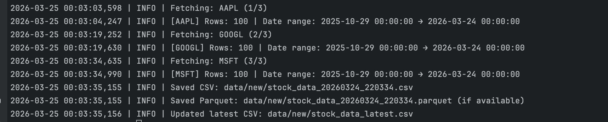

# API Collector — ETL Pipeline (Python → CSV/Parquet → S3 → Spark)

A small end-to-end ETL-style data pipeline demonstrating real-world data engineering:
	-	Extract stock data from the Alpha Vantage API
	-	Transform with Pandas (cleaning, validation, typing)
	-	Load locally into CSV + Parquet
	-	Optionally upload to AWS S3
	-	Process with PySpark (local Databricks-style ETL)
	-	Run tests via GitHub Actions CI
---

This project demonstrates how Python, CI, AWS, and Spark can work together in a small, clear, end-to-end data pipeline.

## Quick start
```bash
git clone https://github.com/Annette3125/api-collector.git
cd api-collector
python -m venv venv
source venv/bin/activate
pip install -r requirements.txt
cp .env.sample .env
python -m api_collector.get_data
```

Expected: creates `data/new/stock_data_latest.csv` and timestamped CSV/Parquet snapshots.

## Example run output




Pipeline: Alpha Vantage → get_data.py → CSV/Parquet → (optional) S3 → (optional) Spark summary → tests/CI.


Output contract: CSV columns are always: `date, open, high, low, close, volume, symbol`.


## 🧩 Features

### Extract

- Pulls TIME_SERIES_DAILY stock data via Alpha Vantage API
- Supports multiple symbols (configurable in `.env`)
- Handles rate limits and HTTP errors

### Transform

- Renames and normalizes columns
- Converts datatypes (numeric, datetime)
- Drops invalid rows (negative or missing prices)
- Sorts by date, removes duplicates

### Load

-	Saves fresh snapshot as:
	- data/new/stock_data_latest.csv
	- timestamped history files
	- Parquet outputs for further analytics

### Output

Example CSV schema:

```csv
date,open,high,low,close,volume,symbol
```

## ⚙️ Setup

### Prerequisites

- Python 3.11+
- Git


Environment variables

Create .env from sample:

```bash
cp .env.sample .env
```

```env
ALPHA_VANTAGE_API_KEY=your-api-key
SYMBOLS=AAPL,GOOGL,MSFT
DATA_DIR=data/new
RATE_LIMIT_SLEEP=15
```

Get a free API key from Alpha Vantage: https://www.alphavantage.co/support/#api-key

### Run

Extract + Transform + Load

```bash
python -m api_collector.get_data
```


Sample output files 

- data/new/stock_data_latest.csv
- data/new/stock_data_<timestamp>.csv
- data/new/stock_data_<timestamp>.parquet

Timestamp format: `YYYYMMDD_HHMMSS` (UTC).


Daily scheduler (optional)

```bash
python -m api_collector.scheduler
```

## ☁️ AWS S3 upload (optional)


1. Configure AWS credentials locally
```bash
aws configure
```

To use S3 upload, configure AWS credentials locally (or use an IAM role) and set `S3_BUCKET_NAME` in `.env`.

2. Set S3 bucket in .env:

```env
S3_BUCKET_NAME=your-bucket-name
S3_KEY=raw/stock_data_latest.csv
```

3. Upload latest CSV:

```bash
python -m api_collector.upload_to_s3
```

Example output:
```bash
s3://<your-bucket-name>/raw/stock_data_latest.csv
```


## 🔥 Local Spark ETL (optional)

macOS prerequisites:
```bash
export JAVA_HOME="$(/usr/libexec/java_home -v 17)"
export SPARK_LOCAL_IP=127.0.0.1
```

Run Spark ETL: 

```bash
python -m api_collector.databricks_etl
```
or:

```bash
./scripts/run_spark.sh
```

Output: `data/processed/stock_summary.parquet`

 
## 🧪 Tests

```bash
pytest -q
```

CI runs automatically on every GitHub push.


 ## 🚀 Future improvements

- Upload processed Parquet to S3
- Orchestrator (Airflow/Prefect)
- Streamlit dashboard
- Small FastAPI service for querying results


